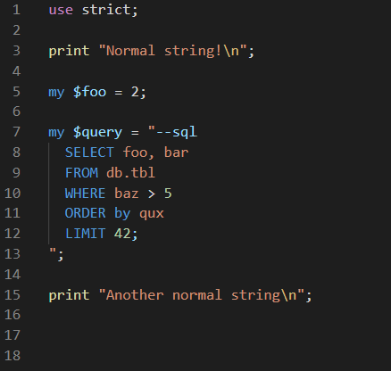

# SQL highlighting in Perl for VS Code 

Adds syntax highlight support for Perl SQL strings in VS Code. This repo is a clone from https://github.com/ptweir/python-string-sql

This extension is also available on the marketplace at https://marketplace.visualstudio.com/items?itemName=bscan.perl-string-sql

## Example

## Usage

Insert `--sql`, `--beginsql`, or `--begin-sql` at the beginning of the part of the string you would like highlighted and a semicolon, `--endsql`, or `--end-sql` at the end of the highlighted section.

## Requirements

- Visual Studio Code v1.32.0 recommended
- Comments at beginning and end of highlighted section in the string (see Usage section).

## Release Notes

### [1.0.0] - 2020-10-30
- First version ported from Python to Perl

